# PIN Authentication System - Architecture & Flow

## System Overview Diagram

```mermaid
graph TB
    subgraph Frontend["🖥️ FRONTEND (React/TypeScript)"]
        PINForm["📱 PIN Verification Form"]
        AdminPanel["👨‍💼 Admin Dashboard"]
        LoginForm["🔑 Login Page"]
    end
    
    subgraph Services["🔧 SERVICE LAYER"]
        PinService["📌 PIN Service"]
        AuthService["🔐 Auth Service"]
        SupabaseClient["🌐 Supabase Client"]
    end
    
    subgraph Database["🗄️ SUPABASE POSTGRESQL"]
        UsersTable["👥 users (table)"]
        AuditTable["📋 audit_logs (table)"]
    end
    
    PINForm -->|"verifyPin(pin)"| PinService
    AdminPanel -->|"approveUserWithPin(userId)"| PinService
    AdminPanel -->|"rejectUserRequest(userId)"| PinService
    LoginForm -->|"authenticate()"| AuthService
    
    PinService -->|"SELECT, UPDATE"| SupabaseClient
    AuthService -->|"SELECT, UPDATE"| SupabaseClient
    
    SupabaseClient -->|"query"| UsersTable
    SupabaseClient -->|"insert"| AuditTable
    
    AuthService -->|"check status"| UsersTable
    
    style Frontend fill:#e1f5ff
    style Services fill:#f3e5f5
    style Database fill:#fff3e0
```



## PIN Verification Flow (Three-Method Protocol)

```mermaid
sequenceDiagram
    participant User as 👤 User
    participant Frontend as 🖥️ Browser
    participant Service as 🔧 pinService
    participant DB as 🗄️ Database
    
    User->>Frontend: Enter PIN (e.g., "538463")
    Frontend->>Service: verifyPin("538463")
    
    Note over Service: 🧹 CLEAN INPUT
    Service->>Service: Clean: "538463" → trim → validate
    
    Note over Service: 🔍 METHOD 1: Exact Match Query
    Service->>DB: eq('pin_code', '538463')
    DB-->>Service: Found? User with PIN
    
    alt ✅ Found in Method 1
        Service->>Service: Check status (approved/active)
        Service->>DB: UPDATE status = 'active'
        Service-->>Frontend: ✅ User verified
    else ❌ Not found in Method 1
        Note over Service: 🔍 METHOD 2: Manual JS Search
        Service->>DB: GET all users WITH pin_code
        DB-->>Service: [all users with PINs]
        Service->>Service: Manual search in JavaScript
        
        alt ✅ Found in Method 2
            Service->>DB: UPDATE status = 'active'
            Service-->>Frontend: ✅ User verified
        else ❌ Not found in Method 2
            Note over Service: 🔍 METHOD 3: Debug Listing
            Service->>DB: GET all PINs with analysis
            Service->>Service: Display all available PINs
            Service-->>Frontend: ❌ PIN not found
        end
    end
    
    Frontend-->>User: Success/Failure message
```



## Admin Approval Workflow

```mermaid
sequenceDiagram
    participant Admin as 👨‍💼 Admin
    participant Dashboard as 📊 Admin Panel
    participant Service as 🔧 pinService
    participant DB as 🗄️ Database
    participant Console as 📝 Browser Console
    
    Admin->>Dashboard: Click "Approve" button
    Dashboard->>Console: 🔐 APPROVAL PROCESS START
    
    Dashboard->>Service: approveUserWithPin(userId, adminId)
    
    Note over Service: 📌 STEP 1: Generate PIN
    Service->>Service: Math.random() → "538463"
    Service->>DB: Check uniqueness
    DB-->>Service: PIN unique? Yes ✅
    Console-->>Console: 📌 Generated PIN: 538463
    
    Note over Service: 💾 STEP 2: Save to database
    Service->>DB: UPDATE users SET status='approved', pin_code='538463'
    DB-->>Service: Updated successfully ✅
    
    Note over Service: 🔎 STEP 3: Verify saved correctly
    Service->>DB: SELECT pin_code FROM users WHERE id=userId
    DB-->>Service: pin_code = '538463'
    alt PIN Matches
        Service->>Console: ✅ PIN verified in database
    else PIN Mismatch
        Service->>Console: ❌ CRITICAL: PIN MISMATCH
        Service-->>Dashboard: Error: PIN not saved
    end
    
    Note over Service: 📋 STEP 4: Create audit log
    Service->>DB: INSERT audit_logs (action='approved', details=...)
    DB-->>Service: Audit logged ✅
    
    Service-->>Dashboard: { success: true, pin: '538463' }
    
    Dashboard->>Console: 📺 Displaying PIN to admin
    Dashboard->>Admin: Show PIN in secure box
    Dashboard->>Admin: Copy button available
    Console-->>Console: ✅ APPROVAL PROCESS COMPLETE
    
    Admin->>Admin: Copy PIN (📋)
    Admin->>Admin: Send PIN to user
    
    Note over Dashboard: ⏰ Auto-hide PIN after 30 seconds
```



## PIN Status Lifecycle


## Data Type Flow (PIN)


## Error Handling Decision Tree

```mermaid
graph TD
    Start["🔐 PIN Verification<br/>Attempt"] --> Input{Input<br/>valid?}
    
    Input -->|No| Invalid["❌ Invalid format<br/>Length ≠ 6 or<br/>Not all digits"]
    Invalid --> Error1["Return null<br/>Log error"]
    
    Input -->|Yes| Query1["🔍 METHOD 1<br/>Direct DB query"]
    Query1 --> Found1{PIN<br/>found?}
    
    Found1 -->|Yes| Status["✅ Check<br/>status"]
    Found1 -->|No| Query2["🔍 METHOD 2<br/>Manual JS search"]
    
    Query2 --> Found2{PIN<br/>found?}
    Found2 -->|Yes| Status
    Found2 -->|No| Query3["🔍 METHOD 3<br/>Debug listing"]
    
    Query3 --> Debug["Display all<br/>available PINs"]
    Debug --> Error2["❌ PIN not found<br/>Return null"]
    
    Status --> StatusOK{Status<br/>approved/<br/>active?}
    StatusOK -->|No| Error3["❌ User not<br/>approved yet<br/>Return null"]
    StatusOK -->|Yes| Update["🔄 Update status<br/>to 'active'<br/>if needed"]
    Update --> Success["✅ Return<br/>verified user"]
    
    Error1 --> End["❌ End"]
    Error2 --> End
    Error3 --> End
    Success --> End["✅ End"]
    
    style Start fill:#e3f2fd
    style Success fill:#c8e6c9
    style Invalid fill:#ffcdd2
    style Error1 fill:#ffcdd2
    style Error2 fill:#ffcdd2
    style Error3 fill:#ffcdd2
```



## Console Logging Architecture

```mermaid
graph LR
    subgraph DevTools["🔧 Browser DevTools Console"]
        Info["ℹ️ Info logs"]
        Success["✅ Success logs"]
        Warning["⚠️ Warning logs"]
        Error["❌ Error logs"]
        Debug["🔍 Debug logs"]
    end
    
    subgraph Triggers["🎯 Trigger Events"]
        T1["PIN verification attempt"]
        T2["User approval"]
        T3["Status update"]
        T4["Database errors"]
        T5["System crashes"]
    end
    
    subgraph Usage["📊 Usage"]
        U1["Debugging verification failures"]
        U2["Tracing approval process"]
        U3["Identifying data mismatches"]
        U4["Monitoring errors"]
        U5["Understanding failures"]
    end
    
    T1 --> Debug
    T2 --> Success
    T3 --> Info
    T4 --> Error
    T5 --> Error
    
    Debug --> U1
    Success --> U2
    Info --> U3
    Error --> U4
    Error --> U5
```



## Database Schema Relationship


## RLS (Row Level Security) Policy

```mermaid
graph TB
    subgraph Dev["🔧 DEVELOPMENT"]
        D1["RLS DISABLED"]
        D2["All data visible<br/>for testing"]
        D3["Easier debugging"]
    end
    
    subgraph Prod["🔒 PRODUCTION"]
        P1["RLS ENABLED"]
        P2["Policy: Users see<br/>only their own data"]
        P3["Policy: Admins see<br/>all assigned users"]
    end
    
    subgraph Policy["📋 Policy Examples"]
        Pol1["SELECT: auth.uid() = id"]
        Pol2["UPDATE: auth.uid() = id"]
        Pol3["Admin override needed"]
    end
    
    Dev --> Prod
    Prod --> Policy
    
    style Dev fill:#e8f5e9
    style Prod fill:#ffebee
    style Policy fill:#f3e5f5
```



---

## Key Metrics & Thresholds

| Metric | Threshold | Action |
|--------|-----------|--------|
| PIN generation retries | > 5 | Log warning |
| PIN uniqueness collision rate | > 1% | Review algorithm |
| Verification method 1 success rate | < 95% | Investigate |
| Database response time | > 1s | Optimize query |
| Audit log failures | Any | Log but continue |
| Console error count | > 10 in 5 min | Alert admin |

---

## Testing Checklist

```mermaid
checklist
    title PIN System Testing Checklist
    - [] PIN generation creates unique 6-digit codes
    - [] PIN stored as string in database (not number)
    - [] PIN verification works via Method 1 (exact match)
    - [] PIN verification works via Method 2 (JS search)
    - [] PIN verification handles whitespace correctly
    - [] PIN verification handles type mismatches
    - [] Admin approval creates correct PIN
    - [] Admin approval sets status to 'approved'
    - [] User verification sets status to 'active'
    - [] Audit logs created for all approvals
    - [] Audit logs created for all rejections
    - [] Console logs visible in DevTools
    - [] Error messages clear and actionable
    - [] Build succeeds with no errors
    - [] All three verification methods tested
    - [] Database diagnostics work correctly
```

---

## Quick Reference: PIN Troubleshooting

```mermaid
mindmap
  root((🔧 PIN<br/>TROUBLESHOOTING))
    🔍 PIN Not Found
      Check console logs
      Run DB diagnostics
      Check data types
      Look for whitespace
      Verify uniqueness
    ❌ PIN Not Saving
      Check update query
      Check constraints
      Verify status field
      Check transaction
      Look for errors
    🔄 Status Not Updating
      Check RLS policies
      Verify user exists
      Check permissions
      Review constraints
      Test manually
    📊 Verification Fails
      Check Method 1 query
      Run Method 2 JS search
      Review Method 3 debug
      Check user status
      Verify PIN exists
    ⚠️ Admin Can't Approve
      Check admin permissions
      Verify user status='pending'
      Check PIN generation
      Review audit logs
      Check for errors
```



